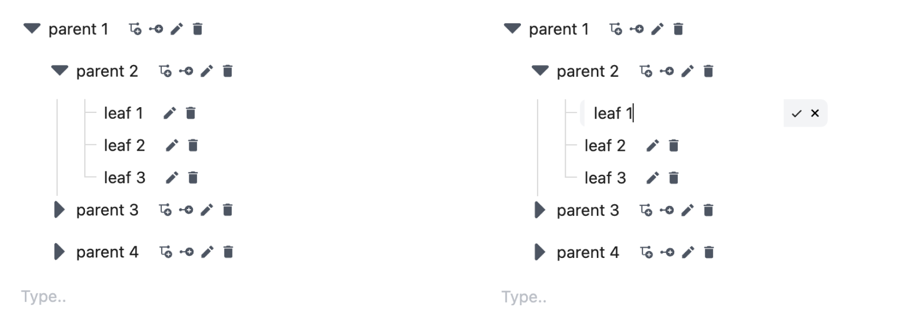

<p align="center" style="border-bottom: none">
  <picture >
    <source media="(prefers-color-scheme: dark)" srcset="./docs/editable-antd-tree-logo-light.png">
    
  </picture>
</p>
<p align="center">This is an editable tree based on antd components.</p>

<br/>

<p align="center">
  
  %3D19.0.0-lighgreen?logo=react" alt="react version" />
  
</p>

> ⚠️ Maintenance Notice: This library is no longer actively updated. It may still work, but future support is not guaranteed.

<br/>

### 📖 Preview



## 📦 Install

```bash
# npm
npm install editable-antd-tree antd lucide-react

# yarn
yarn add editable-antd-tree antd lucide-react

# pnpm
pnpm add editable-antd-tree antd lucide-react

# bun
bun add editable-antd-tree antd lucide-react
```

## 🔨 Usage

Below there is a demonstration of the input data.

```js
const tree = [
  {
    key: "1",
    title: "Technology",
    isLeaf: false,
    children: [
      {
        key: "2",
        parent: "1",
        title: "Phones",
        isLeaf: false,
        children: [
          // ...
        ],
      },
      {
        key: "3",
        parent: "1",
        title: "Laptops",
        isLeaf: true,
      },
    ],
    // ...
  },
  // ...
];
```

### Basic Example

```jsx
import { EditableAntdTree } from "editable-antd-tree";
import "editable-antd-tree/index.css"; // Import compiled styles

const initTree = []; // 👀 example above

const App = () => (
  <>
    <EditableAntdTree treeData={initTree} />
  </>
);
```

### 🎨 Styling Options

This package uses **Tailwind CSS** for styling. You have two options for integrating it into your project:

#### Option 1: Import Compiled CSS (Recommended for most users)

This is the simplest approach and works out of the box:

```jsx
import "editable-antd-tree/index.css";
```

#### Option 2: Use Your Tailwind Configuration (Advanced)

If you're already using Tailwind CSS in your project and want to share the same Tailwind build:

1. **Add the package to your Tailwind content paths:**

```js
// tailwind.config.js
export default {
  content: [
    "./src/**/*.{js,jsx,ts,tsx}",
    "./node_modules/editable-antd-tree/dist/**/*.{js,mjs}", // Add this line
  ],
  // ... rest of your config
};
```

2. **Don't import the CSS file** - your Tailwind build will include the necessary styles

### 🎨 Custom Styling

You can customize the appearance using the `classNames` prop:

```jsx
<EditableAntdTree
  treeData={initTree}
  classNames={{
    nodeTitle: "font-bold text-blue-600",
    nodeActions: "space-x-2",
    input: "border-2 border-blue-400",
    confirmBtn: "text-green-700",
    cancelBtn: "text-red-700",
    // ... more customization options
  }}
/>
```

### 🎭 Custom Icons

You can customize all action icons by passing React elements to the `icons` prop:

```jsx
import { EditableAntdTree } from "editable-antd-tree";
import { FolderPlus, FilePlus, Edit, Trash2, CheckCircle, XCircle } from "lucide-react";

<EditableAntdTree
  treeData={initTree}
  icons={{
    createParent: <FolderPlus size={16} />,
    createLeaf: <FilePlus size={16} />,
    update: <Edit size={16} />,
    delete: <Trash2 size={16} />,
    confirm: <CheckCircle size={16} />,
    cancel: <XCircle size={16} />,
  }}
/>;
```

You can use any icon library or even custom SVGs:

```jsx
icons={{
  createParent: <svg>...</svg>,
  createLeaf: ,
  // ... etc
}}
```

### Typescipt

By downloading this package, there is a direct compatability with `typescript`.

## 🔀️ Properties

### Tree

<table>
  <thead>
    <tr>
      <th>Property</th>
      <th>Description</th>
      <th>Type</th>
      <th>Required</th>
    </tr>
  </thead>
  <tbody>
    <tr>
      <td><code>treeData</code></td>
      <td>Initial tree data. See section below for all fields of TreeData.</td>
      <td><code>EditableAntdTreeNode[]</code></td>
      <td align="center">Yes</td>
    </tr>
    <tr>
      <td><code>onTreeChange</code></td>
      <td>Executes uppon any tree data change.</td>
      <td><code>Function</code></td>
      <td align="center">No</td>
    </tr>
    <tr>
      <td><code>switcherIcon</code></td>
      <td>Controls the switcher icon, used to expand or collapse parent nodes.</td>
      <td><code>React.ReactNode</code></td>
      <td align="center">No</td>
    </tr>
    <tr>
      <td><code>size</code></td>
      <td>Controls the size of the tree.</td>
      <td><code>xs</code>, <code>sm</code>, <code>md</code>, <code>lg</code>, <code>xl</code></td>
      <td align="center">No</td>
    </tr>
    <tr>
      <td><code>loadData</code></td>
      <td>Function triggered when a non-leaf TreeNode lacks children. Loads data asynchronously and replaces TreeNode's children.</td>
      <td><code>Function</code></td>
      <td align="center">No</td>
    </tr>
    <tr>
      <td><code>createRootLeaf</code></td>
      <td>Contains properties explained in the sections below.</td>
      <td><code>Object</code></td>
      <td align="center">No</td>
    </tr>
    <tr>
      <td><code>createRootParent</code></td>
      <td>Contains properties explained in the sections below.</td>
      <td><code>Object</code></td>
      <td align="center">No</td>
    </tr>
    <tr>
      <td><code>deleteNode</code></td>
      <td>Contains properties explained in the sections below.</td>
      <td><code>Object</code></td>
      <td align="center">No</td>
    </tr>
    <tr>
      <td><code>updateNode</code></td>
      <td>Contains properties explained in the sections below.</td>
      <td><code>Object</code></td>
      <td align="center">No</td>
    </tr>
    <tr>
      <td><code>createLeaf</code></td>
      <td>Contains properties explained in the sections below.</td>
      <td><code>Object</code></td>
      <td align="center">No</td>
    </tr>
    <tr>
      <td><code>createParent</code></td>
      <td>Contains properties explained in the sections below.</td>
      <td><code>Object</code></td>
      <td align="center">No</td>
    </tr>
    <tr>
      <td><code>icons</code></td>
      <td>Customize the icons used for all actions (createParent, createLeaf, update, delete, confirm, cancel). Pass any React elements.</td>
      <td><code>Partial&lt;IconConfig&gt;</code></td>
      <td align="center">No</td>
    </tr>
    <tr>
      <td><code>showActionsOnHover</code></td>
      <td>If true, action buttons are only visible when hovering over a node. If false, they are always visible.</td>
      <td><code>boolean</code></td>
      <td align="center">No</td>
    </tr>
    <tr>
      <td><code>hideRootControls</code></td>
      <td>If true, hides the footer controls for creating root nodes.</td>
      <td><code>boolean</code></td>
      <td align="center">No</td>
    </tr>
    <tr>
      <td><code>classNames</code></td>
      <td>Custom CSS class names for styling various parts of the tree (nodeTitle, nodeActions, input, buttons, root, tree, footer, etc.).</td>
      <td><code>Object</code></td>
      <td align="center">No</td>
    </tr>
  </tbody>
</table>

### Create Root Leaf

<table>
  <thead>
    <tr>
      <th>Property</th>
      <th>Description</th>
      <th style="text-align: center">Type</th>
      <th>Required</th>
    </tr>
  </thead>
  <tbody>
    <tr>
      <td><code>label</code></td>
      <td>This property shows what should be displayed when a user hovers over the action.</td>
      <td style="text-align: center"><code>string</code></td>
      <td style="text-align: center">No</td>
    </tr>
    <tr>
      <td><code>disabled</code></td>
      <td>This property indicates if the action should be disabled.</td>
      <td style="text-align: center"><code>boolean</code></td>
      <td style="text-align: center">No</td>
    </tr>
    <tr>
      <td><code>onAction</code></td>
      <td>This property is a Function that runs after the action has been pressed.</td>
      <td style="text-align: center"><code>Function</code></td>
      <td style="text-align: center">No</td>
    </tr>
  </tbody>
</table>

### Create Root Parent

<table>
  <thead>
    <tr>
      <th>Property</th>
      <th>Description</th>
      <th style="text-align: center">Type</th>
      <th>Required</th>
    </tr>
  </thead>
  <tbody>
    <tr>
      <td><code>label</code></td>
      <td>This property shows what should be displayed when a user hovers over the action.</td>
      <td style="text-align: center"><code>string</code></td>
      <td style="text-align: center">No</td>
    </tr>
    <tr>
      <td><code>disabled</code></td>
      <td>This property indicates if the action should be disabled.</td>
      <td style="text-align: center"><code>boolean</code></td>
      <td style="text-align: center">No</td>
    </tr>
    <tr>
      <td><code>onAction</code></td>
      <td>This property is a Function that runs after the action has been pressed.</td>
      <td style="text-align: center"><code>Function</code></td>
      <td style="text-align: center">No</td>
    </tr>
  </tbody>
</table>

### Delete Node

<table>
  <thead>
    <tr>
      <th>Property</th>
      <th>Description</th>
      <th style="text-align: center">Type</th>
      <th>Required</th>
    </tr>
  </thead>
  <tbody>
    <tr>
      <td><code>label</code></td>
      <td>This property shows what should be displayed when a user hovers over the action.</td>
      <td style="text-align: center"><code>string</code></td>
      <td style="text-align: center">No</td>
    </tr>
    <tr>
      <td><code>disabled</code></td>
      <td>This property indicates if the action should be disabled.</td>
      <td style="text-align: center"><code>boolean</code> | <code>Function</code></td>
      <td style="text-align: center">No</td>
    </tr>
    <tr>
      <td><code>onAction</code></td>
      <td>This property is a Function that runs after the action has been pressed.</td>
      <td style="text-align: center"><code>Function</code></td>
      <td style="text-align: center">No</td>
    </tr>
  </tbody>
</table>

### Update Node

<table>
  <thead>
    <tr>
      <th>Property</th>
      <th>Description</th>
      <th style="text-align: center">Type</th>
      <th>Required</th>
    </tr>
  </thead>
  <tbody>
    <tr>
      <td><code>label</code></td>
      <td>This property shows what should be displayed when a user hovers over the action.</td>
      <td style="text-align: center"><code>string</code></td>
      <td style="text-align: center">No</td>
    </tr>
    <tr>
      <td><code>disabled</code></td>
      <td>This property indicates if the action should be disabled.</td>
      <td style="text-align: center"><code>boolean</code> | <code>Function</code></td>
      <td style="text-align: center">No</td>
    </tr>
    <tr>
      <td><code>onAction</code></td>
      <td>This property is a Function that runs after the action has been pressed.</td>
      <td style="text-align: center"><code>Function</code></td>
      <td style="text-align: center">No</td>
    </tr>
  </tbody>
</table>

### Create Leaf Node

<table>
  <thead>
    <tr>
      <th>Property</th>
      <th>Description</th>
      <th style="text-align: center">Type</th>
      <th>Required</th>
    </tr>
  </thead>
  <tbody>
    <tr>
      <td><code>label</code></td>
      <td>This property shows what should be displayed when a user hovers over the action.</td>
      <td style="text-align: center"><code>string</code></td>
      <td style="text-align: center">No</td>
    </tr>
    <tr>
      <td><code>disabled</code></td>
      <td>This property indicates if the action should be disabled.</td>
      <td style="text-align: center"><code>boolean</code> | <code>Function</code></td>
      <td style="text-align: center">No</td>
    </tr>
    <tr>
      <td><code>onAction</code></td>
      <td>This property is a Function that runs after the action has been pressed.</td>
      <td style="text-align: center"><code>Function</code></td>
      <td style="text-align: center">No</td>
    </tr>
  </tbody>
</table>

### Create Parent Node

<table>
  <thead>
    <tr>
      <th>Property</th>
      <th>Description</th>
      <th style="text-align: center">Type</th>
      <th>Required</th>
    </tr>
  </thead>
  <tbody>
    <tr>
      <td><code>label</code></td>
      <td>This property shows what should be displayed when a user hovers over the action.</td>
      <td style="text-align: center"><code>string</code></td>
      <td style="text-align: center">No</td>
    </tr>
    <tr>
      <td><code>disabled</code></td>
      <td>This property indicates if the action should be disabled.</td>
      <td style="text-align: center"><code>boolean</code> | <code>Function</code></td>
      <td style="text-align: center">No</td>
    </tr>
    <tr>
      <td><code>onAction</code></td>
      <td>This property is a Function that runs after the action has been pressed.</td>
      <td style="text-align: center"><code>Function</code></td>
      <td style="text-align: center">No</td>
    </tr>
  </tbody>
</table>

> \+ All [Tree](https://ant.design/components/tree#tree-props) properties of antd tree component.

### Tree Data

<table>
  <thead>
    <tr>
      <th>Property</th>
      <th>Description</th>
      <th style="text-align: center">Type</th>
      <th>Required</th>
    </tr>
  </thead>
  <tbody>
    <tr>
      <td><code>key</code></td>
      <td>This field is used as a unique identifier.</td>
      <td style="text-align: center"><code>string</code></td>
      <td style="text-align: center">Yes</td>
    </tr> 
    <tr>
      <td><code>title</code></td>
      <td>This field is displayed in the tree.</td>
      <td style="text-align: center"><code>string</code></td>
      <td style="text-align: center">No</td>
    </tr> 
    <tr>
      <td><code>parent</code></td>
      <td>This field points to the parent key.</td>
      <td style="text-align: center"><code>string</code></td>
      <td style="text-align: center">No</td>
    </tr> 
    <tr>
      <td><code>children</code></td>
      <td>This field contains more nested tree nodes.</td>
      <td style="text-align: center"><code>EditableAntdTreeNode[]</code></td>
      <td style="text-align: center">No</td>
    </tr> 
  </tbody>
</table>

> \+ All [TreeNode](https://ant.design/components/tree#tree-props) properties of antd tree component.

## ✨ Acknowledgements

Special acknowledgements to the following packages:

- https://www.npmjs.com/package/antd
- https://www.npmjs.com/package/editable-tree-antd

## 🎙 Conclusion

After experimenting with various npm packages, none of them quite met my specific requirements. However, drawing inspiration from the packages mentioned earlier, I took it upon myself to develop a solution tailored to my needs, resulting in the creation of the editable-antd-tree package.
