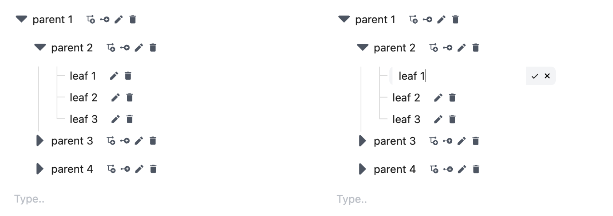

<h1 align="center" style="border-bottom: none">
  <font size="7">🌴 EditableAntdTree 🌴</font>
</h1>
<h4 align="center">This is an editable tree based on antd components.</h4>

<br/>

<p align="center">
  
  
  %3D16.9.0-lighgreen?logo=react" alt="react version" />
  
</p>

<br/>

### 📖 Preview



## 📦 Install

```bash
$ npm editable-antd-tree
```

```bash
$ yarn editable-antd-tree
```

> The package can be found [here](https://www.npmjs.com/package/editable-antd-tree).

## 🔨 Usage

Below there is a demonstration of the input data.

```js
const tree = [
  {
    key: "1",
    title: "Technology",
    isLeaf: false,
    children: [
      {
        key: "2",
        parent: "1",
        title: "Phones",
        isLeaf: false,
        children: [
          // ...
        ],
      },
      {
        key: "3",
        parent: "1",
        title: "Laptops",
        isLeaf: true,
      },
    ],
    // ...
  },
  // ...
];
```

A simple example of this package can be seen below.

```js
import { EditableAntdTree } from "editable-antd-tree";

import "editable-antd-tree/dist/esm/output.css"; // load style

const initTree = []; // 👀 example above

const App = () => (
  <>
    <EditableAntdTree treeData={initTree} />
  </>
);
```

### Typescipt

By downloading this package, there is a direct compatability with `typescript`.

## 🔀️ Properties

### Tree

<table>
  <thead>
    <tr> 
      <th>Property</th>
      <th>Description</th>
      <th style="text-align: center">Type</th>
      <th>Required</th>
    </tr> 
  </thead>
  <tbody>
    <tr> 
      <th>treeData</th>
      <th>This property indicates the inital tree data. (There is a section which shows all the fields of TreeData fields)</th>
      <th style="text-align: center">EditableTreeNode[]</th>
      <th style="text-align: center">yes</th>
    </tr> 
    <tr> 
      <th>switcherIcon</th>
      <th>This property controls the switcher icon, the icon that expands or collapse a parent node.</th>
      <th style="text-align: center">React.ReactNode</th>
      <th style="text-align: center">no</th>
    </tr> 
    <tr> 
      <th>size</th>
      <th>This property controls the size of the tree.</th>
      <th style="text-align: center">xs | sm | md | lg | xl</th>
      <th style="text-align: center">no</th>
    </tr> 
    <tr> 
      <th>loadData</th>
      <th>This property is a Function that runs whenever a TreeNode is not a leaf node & it has no children. Its core function is to load data async and replace them into the TreeNode children field.</th>
      <th style="text-align: center">Function</th>
      <th style="text-align: center">no</th>
    </tr> 
    <tr> 
      <th>createRootParent</th>
      <th>This property is a Function that runs after a root parent node the is created.</th>
      <th style="text-align: center">Function</th>
      <th style="text-align: center">no</th>
    </tr> 
    <tr> 
      <th>deleteNode</th>
      <th>This object contains some properties that are explained in the sections below.</th>
      <th style="text-align: center">Object</th>
      <th style="text-align: center">no</th>
    </tr>    
    <tr> 
      <th>updateNode</th>
      <th>This object contains some properties that are explained in the sections below.</th>
      <th style="text-align: center">Object</th>
      <th style="text-align: center">no</th>
    </tr>    
    <tr> 
      <th>createLeaf</th>
      <th>This object contains some properties that are explained in the sections below.</th>
      <th style="text-align: center">Object</th>
      <th style="text-align: center">no</th>
    </tr>     
    <tr> 
      <th>createParent</th>
      <th>This object contains some properties that are explained in the sections below.</th>
      <th style="text-align: center">Object</th>
      <th style="text-align: center">no</th>
    </tr> 
  </tbody>
</table>

### Delete Node

<table>
  <thead>
    <tr> 
      <th>Property</th>
      <th>Description</th>
      <th style="text-align: center">Type</th>
      <th>Required</th>
    </tr> 
  </thead>
  <tbody>
    <tr> 
      <th>caption</th>
      <th>This property shows what should be displayed when a user hovers over the action.</th>
      <th style="text-align: center">string</th>
      <th style="text-align: center">no</th>
    </tr> 
    <tr> 
      <th>disable</th>
      <th>This property indicated if the action should be disabled.</th>
      <th style="text-align: center">boolean | Function</th>
      <th style="text-align: center">no</th>
    </tr> 
    <tr> 
      <th>event</th>
      <th>This property is a Function that runs after the action has been pressed.</th>
      <th style="text-align: center">Function</th>
      <th style="text-align: center">no</th>
    </tr> 
  </tbody>
</table>

### Update Node

<table>
  <thead>
    <tr> 
      <th>Property</th>
      <th>Description</th>
      <th style="text-align: center">Type</th>
      <th>Required</th>
    </tr> 
  </thead>
  <tbody>
    <tr> 
      <th>caption</th>
      <th>This property shows what should be displayed when a user hovers over the action.</th>
      <th style="text-align: center">string</th>
      <th style="text-align: center">no</th>
    </tr> 
    <tr> 
      <th>disable</th>
      <th>This property indicated if the action should be disabled.</th>
      <th style="text-align: center">boolean | Function</th>
      <th style="text-align: center">no</th>
    </tr> 
    <tr> 
      <th>event</th>
      <th>This property is a Function that runs after the action has been pressed.</th>
      <th style="text-align: center">Function</th>
      <th style="text-align: center">no</th>
    </tr> 
  </tbody>
</table>

### Create Leaf Node

<table>
  <thead>
    <tr> 
      <th>Property</th>
      <th>Description</th>
      <th style="text-align: center">Type</th>
      <th>Required</th>
    </tr> 
  </thead>
  <tbody>
    <tr> 
      <th>caption</th>
      <th>This property shows what should be displayed when a user hovers over the action.</th>
      <th style="text-align: center">string</th>
      <th style="text-align: center">no</th>
    </tr> 
    <tr> 
      <th>disable</th>
      <th>This property indicated if the action should be disabled.</th>
      <th style="text-align: center">boolean | Function</th>
      <th style="text-align: center">no</th>
    </tr> 
    <tr> 
      <th>event</th>
      <th>This property is a Function that runs after the action has been pressed.</th>
      <th style="text-align: center">Function</th>
      <th style="text-align: center">no</th>
    </tr> 
  </tbody>
</table>

### Create Parent Node

<table>
  <thead>
    <tr> 
      <th>Property</th>
      <th>Description</th>
      <th style="text-align: center">Type</th>
      <th>Required</th>
    </tr> 
  </thead>
  <tbody>
    <tr> 
      <th>caption</th>
      <th>This property shows what should be displayed when a user hovers over the action.</th>
      <th style="text-align: center">string</th>
      <th style="text-align: center">no</th>
    </tr> 
    <tr> 
      <th>disable</th>
      <th>This property indicated if the action should be disabled.</th>
      <th style="text-align: center">boolean | Function</th>
      <th style="text-align: center">no</th>
    </tr> 
    <tr> 
      <th>event</th>
      <th>This property is a Function that runs after the action has been pressed.</th>
      <th style="text-align: center">Function</th>
      <th style="text-align: center">no</th>
    </tr> 
  </tbody>
</table>

> \+ All [Tree](https://ant.design/components/tree#tree-props) properties of antd tree component.

### Tree Data

<table>
  <thead>
    <tr> 
      <th>Property</th>
      <th>Description</th>
      <th style="text-align: center">Type</th>
      <th style="text-align: center">Required</th>
    </tr> 
  </thead>
  <tbody>
    <tr> 
      <th>key</th>
      <th>This field is used as a unique identifier.</th>
      <th style="text-align: center">string</th>
      <th style="text-align: center">yes</th>
    </tr> 
    <tr> 
      <th>title</th>
      <th>This field is displayed in the tree.</th>
      <th style="text-align: center">string</th>
      <th style="text-align: center">no</th>
    </tr> 
    <tr> 
      <th>parent</th>
      <th>This field points to the parent key.</th>
      <th style="text-align: center">string</th>
      <th style="text-align: center">no</th>
    </tr> 
    <tr> 
      <th>children</th>
      <th>This field contains more nested tree nodes.</th>
      <th style="text-align: center">EditableTreeNode[]</th>
      <th style="text-align: center">no</th>
    </tr> 
  </tbody>
</table>

> \+ All [TreeNode](https://ant.design/components/tree#tree-props) properties of antd tree component.

## ✨ Acknowledgements

Special acknowledgements to the following packages:

- https://www.npmjs.com/package/antd
- https://www.npmjs.com/package/editable-tree-antd

## 🎙 Conclusion

I tried some npm packages but they did not fit my use case, so I was inspired by the above packages and created the `editable-antd-tree`.
